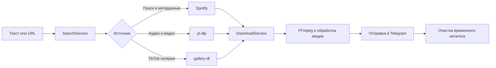

<div align="center">

# DW Bot

**Telegram-бот для поиска и скачивания аудио, видео и фотогалерей**


Ищет треки по названию, разбирает ссылки популярных платформ, предлагает
доступные форматы и отправляет готовые медиафайлы прямо в Telegram.

</div>

---

## Возможности

| | |
| --- | --- |
| 🔎 **Поиск музыки** | Ищет треки через Spotify и показывает до 10 результатов |
| 🎧 **Готовое аудио** | Скачивает трек, конвертирует в MP3 и добавляет название, исполнителя и обложку |
| 🎬 **Выбор качества** | Показывает доступные разрешения YouTube и вариант «Только звук» |
| 🖼️ **Фотогалереи** | Отправляет TikTok-фотографии медиагруппами с учётом лимитов Telegram |
| 🍪 **Cookies для YouTube** | Повторяет запрос с cookies, если обычная загрузка или получение форматов завершились ошибкой |
| ⚡ **Inline-режим** | Принимает ссылки через `@username_бота <URL>` в любом чате |
| 🌐 **Раздельные прокси** | Поддерживает независимые прокси для Telegram и внешних медиасервисов |
| 🐳 **Готовый контейнер** | В образ уже входят Python, FFmpeg, `ffprobe` и Deno |

## Поддерживаемые источники

| Источник | Что делает бот |
| --- | --- |
| Текстовый запрос | Ищет треки в Spotify и предлагает выбрать результат |
| Spotify | Получает метаданные, скачивает аудио и добавляет обложку |
| YouTube | Показывает разрешения видео и вариант «Только звук» |
| YouTube Shorts | Скачивает видео напрямую |
| YouTube Music | Скачивает аудио |
| TikTok | Раскрывает короткие ссылки, скачивает видео и фотогалереи |
| Instagram | Скачивает видео по публичной ссылке |
| Pinterest | Скачивает видео по публичной ссылке |
| VK / VK Видео | Скачивает клипы |

## Как это работает



Один запрос проходит следующие этапы:

1. `SearchService` определяет, является ввод поисковым запросом или ссылкой.
2. Для Spotify и обычных YouTube-видео бот формирует inline-клавиатуру выбора.
3. `DownloadService` направляет задачу подходящему провайдеру.
4. Провайдер скачивает файл и при необходимости запускает FFmpeg.
5. Бот проверяет размер, отправляет результат пользователю и очищает временные файлы.

Для YouTube первая попытка выполняется без cookies. Если `yt-dlp` возвращает
ошибку и файл cookies настроен, бот повторяет запрос с авторизацией. Это работает
как для загрузки медиа, так и для получения списка доступных разрешений.

## Быстрый старт

### 1. Создайте `.env`

```bash
cp .env.example .env
```

Заполните обязательные значения:

```dotenv
BOT_TOKEN=telegram-bot-token
SPOTIFY_CLIENT_ID=spotify-client-id
SPOTIFY_CLIENT_SECRET=spotify-client-secret

# Необязательно
COOKIES_FILE=youtube.cookies.txt
MEDIA_PROXY=
TELEGRAM_PROXY=
LOG_LEVEL=INFO
SEARCH_LIMIT=5
MAX_UPLOAD_SIZE_MB=49
INLINE_CACHE_CHAT_ID=
```

Файл `.env` исключён из Git и Docker build context. Не добавляйте токены и
секреты в репозиторий.

### 2. При необходимости добавьте YouTube cookies

Compose монтирует локальный каталог `data` внутрь контейнера как `/app/data`:

```text
хост:       <каталог проекта>/data/youtube.cookies.txt
контейнер:  /app/data/youtube.cookies.txt
```

Создайте каталог, поместите туда Netscape-файл cookies и ограничьте доступ:

```bash
mkdir -p data
chmod 600 data/youtube.cookies.txt
```

Имя файла должно совпадать со значением `COOKIES_FILE`. Путь в переменной не
обязателен: конфигурация берёт имя и ищет файл именно в `/app/data`.

> **Безопасность:** cookies дают доступ к вашей YouTube-сессии. Используйте
> отдельный аккаунт, не публикуйте файл и регулярно обновляйте его.

### 3. Запустите бота

```bash
docker compose up -d --build
docker compose logs -f download-bot
```

Остановка:

```bash
docker compose down
```

## Настройки

| Переменная | По умолчанию | Назначение |
| --- | ---: | --- |
| `BOT_TOKEN` | — | Токен Telegram-бота от BotFather |
| `SPOTIFY_CLIENT_ID` | — | Client ID приложения Spotify |
| `SPOTIFY_CLIENT_SECRET` | — | Client Secret приложения Spotify |
| `COOKIES_FILE` | — | Имя Netscape-файла в `/app/data` для повторных YouTube-запросов |
| `MEDIA_PROXY` | — | Прокси для Spotify, `yt-dlp` и `gallery-dl` |
| `TELEGRAM_PROXY` | — | Прокси подключения к Telegram Bot API |
| `LOG_LEVEL` | `INFO` | `DEBUG`, `INFO`, `WARNING`, `ERROR` или `CRITICAL` |
| `SEARCH_LIMIT` | `5` | Количество результатов Spotify, допустимо 1–10 |
| `MAX_UPLOAD_SIZE_MB` | `49` | Максимальный размер одного медиафайла |
| `INLINE_CACHE_CHAT_ID` | — | Чат или канал для служебной загрузки inline-медиа |
| `IMAGE_TAG` | `latest` | Тег Docker-образа, используемый Compose |

Обязательны `BOT_TOKEN`, `SPOTIFY_CLIENT_ID` и `SPOTIFY_CLIENT_SECRET`.
`COOKIES_FILE` можно оставить пустым; тогда повторные запросы с авторизацией
будут отключены.

## Inline-режим

В BotFather включите:

1. Inline Mode командой `/setinline`.
2. Inline feedback командой `/setinlinefeedback`.
3. Для feedback выберите 100%, иначе бот будет получать не все события выбора.

После этого пользователь может написать:

```text
@username_бота <URL>
```

Бот покажет временный результат «Готовлю файл...», скачает медиа и заменит его
готовым файлом. Если `INLINE_CACHE_CHAT_ID` не задан, пользователь должен хотя бы
один раз открыть бота в личных сообщениях, чтобы Telegram разрешил служебную
загрузку.

## Структура проекта

```text
app/
├── bot/          # Обработчики Telegram, роутер и клавиатуры
├── core/         # Настройки и конфигурация логирования
├── errors/       # Прикладные исключения и публичные сообщения
├── models/       # Типы запросов и медиа
├── providers/    # Spotify, yt-dlp, gallery-dl и обработка обложек
└── services/     # Разбор запросов и координация скачивания
```

Точка входа — `main.py`. Загруженные файлы создаются во временных каталогах и
удаляются после отправки, поэтому постоянное хранилище медиа боту не требуется.

## Локальная разработка

Требования:

- Python 3.11 или новее;
- FFmpeg и `ffprobe` в `PATH`;
- Deno в `PATH` для JavaScript-компонентов `yt-dlp`;
- настроенный `.env`.

PowerShell:

```powershell
python -m venv .venv
.\.venv\Scripts\Activate.ps1
python -m pip install --upgrade pip
pip install -r requirements.txt
python main.py
```

При локальном запуске `COOKIES_FILE=youtube.cookies.txt` указывает на файл:

```text
<корень проекта>/data/youtube.cookies.txt
```

Проверка синтаксиса:

```powershell
python -m compileall -q app main.py
```

## Безопасность и ограничения

- Бот зависит от доступности Telegram, Spotify и структуры внешних сайтов.
- После изменений YouTube, TikTok и других платформ может потребоваться
  обновление `yt-dlp` или `gallery-dl`.
- Cookies помогают с авторизацией и возрастными ограничениями, но не дают доступ
  к удалённому контенту и материалам без прав аккаунта.
- Региональные ограничения могут потребовать `MEDIA_PROXY`.
- Telegram дополнительно ограничивает типы и размеры отправляемых файлов.
- Бот предназначен только для материалов, которые пользователь имеет право
  скачивать и распространять.

> **Важно:** не передавайте `.env`, cookies и прокси-учётные данные в логи,
> Docker-образы, Git или публичные каналы.

---

<div align="center">

Ищет · скачивает · обрабатывает · отправляет

</div>
